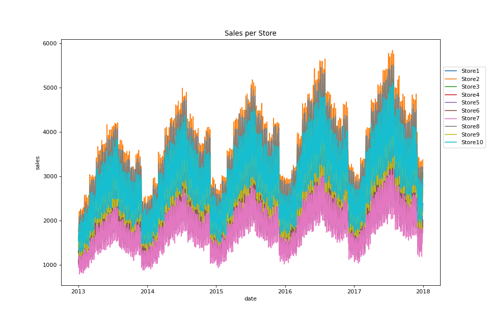
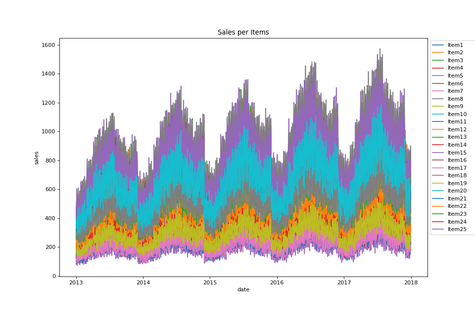

# Sales-Forecasting

In this repo, I am going to forecast on timeseries data, that contain per day sales for several years for 10 different stores for 50 unique items.
I am trying different forecast neural network architectures like Long-Short-Term-Memory (LSTM) networks, Convolutional Neural Networks (CNN) Networks and mixed CNN-LSTM networks.

## The Data
In the following plots we see the datetime on the x-axis and the daily sales on the y-axis.
In the first image, we see the overall daily sales grouped per store (adding sales over all items per store):

In the next image, we see the overall daily sales grouped per unique items (adding sales over all stores per item):

